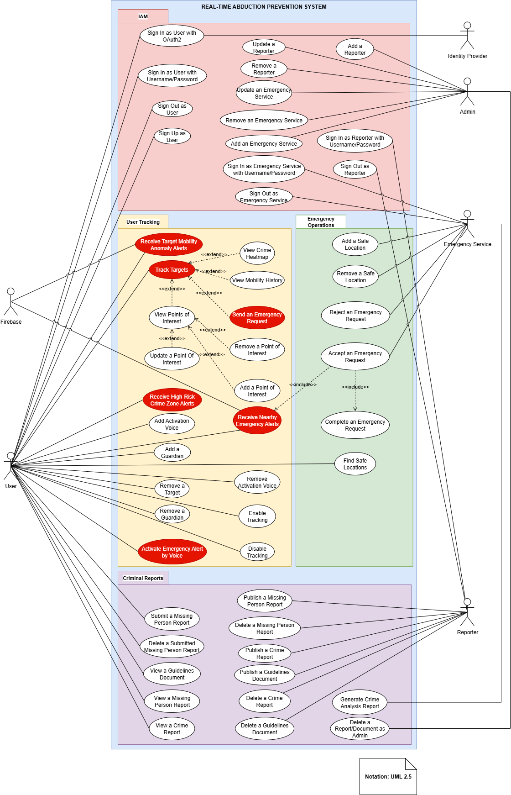

# TrackNest

TrackNest is a event-driven, microservices-based, real-time abduction prevention system designed to enhance safety and emergency response through advanced location tracking, anomaly detection, and coordinated operations. The platform empowers users, responders, and administrators with robust crime information management and immediate emergency response tools—all accessible via a dedicated mobile app and web interface. TrackNest is built for scalability, security, and interoperability, making it ideal for smart city safety initiatives, community protection, and integrated emergency management.

---

## Table of Contents

- [Features](#features)
- [System Architecture](#system-architecture)
- [Technology Stack](#technology-stack)
- [Use Case Overview](#use-case-overview)
- [Component Overview](#component-overview)
- [Getting Started](#getting-started)
- [Contributing](#contributing)
- [License](#license)
- [Documentation](#documentation)

---

## Features

- **Real-Time Location Tracking**: Continuous monitoring of user and target locations.
- **Anomaly Detection**: Immediate alerts for abnormal mobility patterns or high-risk zones.
- **Crime Information Management**: Submit, view, and analyze crime and missing person reports.
- **Emergency Response Coordination**: Rapid emergency request handling and safe location guidance.
- **Role-Based Access**: Support for users, emergency services, reporters, and administrators.
- **Scalable & Secure**: Built using distributed, cloud-ready microservices and secure IAM.

---

## System Architecture

TrackNest leverages a microservices architecture, orchestrating multiple specialized services through an API gateway and message broker for real-time operations and robust data management.

<!-- **Architecture Diagram**:
 -->

**Key Components:**
- **API Gateway (APISIX)**: Central entry point for all clients (mobile/web), managing routing, security, and throttling.
- **User Tracking Service (Python)**: Handles real-time user tracking, anomaly detection, and vector-based mobility analysis.
- **Emergency Operations Service (Spring Boot)**: Manages emergency requests, safe locations, and response coordination.
- **Criminal Reports Service (Spring Boot)**: Supports crime/missing person data management and search.
- **IAM (Keycloak)**: Secure identity and access management for all roles.
- **Databases**: 
  - pgEdge (distributed SQL for all services)
  - Milvus (vector database for advanced tracking)
  - Elasticsearch (advanced search for crime data)
- **Message Broker (Kafka)**: Real-time event and alert propagation across services.
- **Secrets Management (HashiCorp Vault)**: Secures sensitive credentials and secrets for all microservices.
- **Frontends**: 
  - Mobile App (Kotlin)
  - Web App (Nuxt.js)
- **Deployment**: Kubernetes (K8s) and Helm for scalable, resilient, and automated deployment and orchestration.

---

## Technology Stack

| Layer           | Technology                   |
|-----------------|-----------------------------|
| API Gateway     | APISIX                      |
| Message Broker  | Kafka                       |
| User Tracking   | Python, Milvus              |
| Emergency Ops   | Spring Boot, pgEdge         |
| Crime Reports   | Spring Boot, Elasticsearch, pgEdge |
| IAM             | Keycloak, pgEdge            |
| Databases       | pgEdge, Milvus              |
| Search Engine   | Elasticsearch               |
| Secrets         | HashiCorp Vault             |
| Mobile App      | Kotlin                      |
| Web Frontend    | Nuxt.js                     |
| Deployment      | Kubernetes, Docker, Helm    |

---

## Use Case Overview

TrackNest supports a diverse set of actors and workflows, including users, emergency services, reporters, and administrators. The system is designed to address real-world scenarios such as abduction alerts, emergency coordination, and crime reporting.

**Use Case Diagram**:


### Example Use Cases

- **Users**: 
  - Receive anomaly/crime alerts
  - Track and manage personal safety
  - Send emergency requests (voice-activated)
  - Manage guardians and activation voices
- **Emergency Services**:
  - Respond to emergencies
  - Manage safe locations
- **Reporters/Admins**:
  - Publish and manage crime/missing person reports
  - Oversee platform guidelines and data analysis

---

## Component Overview

### Microservices

- **IAM Service**: Authentication and authorization using Keycloak and pgEdge.
- **UserTrackingService**: Real-time tracking, anomaly detection, and vector similarity search (Python, Milvus).
- **EmergencyOpsService**: Orchestrates emergency request lifecycle (Spring Boot).
- **CriminalReportsService**: Manages all crime/missing person report workflows (Spring Boot, Elasticsearch).
- **API Gateway**: Unified entry point, powered by APISIX.
- **Secrets Management**: All sensitive configuration and credentials are secured using HashiCorp Vault.

---

## Getting Started

### Prerequisites

- [Docker](https://www.docker.com/)
- [Kubernetes](https://kubernetes.io/)
- [Helm](https://helm.sh/)
- [kubectl](https://kubernetes.io/docs/tasks/tools/)

### Deployment Steps

1. **Clone the Repository**
    ```bash
    git clone https://github.com/NguyenVu04/track-nest.git
    cd track-nest
    ```

2. **Configure Secrets and Environment**
    - Set up your secrets in HashiCorp Vault.
    - Update the `values.yaml` files in the `helm/` directory with your configuration (database URLs, credentials, etc.).

3. **Install Dependencies**
    - Ensure your Kubernetes cluster is running.
    - Install required Helm charts for dependencies (e.g., Kafka, PostgreSQL, Milvus, Elasticsearch, Keycloak) if not already present.

4. **Deploy TrackNest Microservices**
    ```bash
    helm install --values values.yaml -f values-prod.yaml tracknest ./helm
    ```

5. **Access the Platform**
    - Web app: `http://<your-cluster-ip>:<web-port>`
    - Mobile app: Configure the API endpoint in the app settings.

### Local Development

```bash
helm install --values values.yaml -f values-dev.yaml tracknest ./helm
```

### Troubleshooting

- Check pod and service status:
  ```bash
  kubectl get pods
  kubectl get services
  ```
- Review logs for any failed pods:
  ```bash
  kubectl logs <pod-name>
  ```

For detailed setup and advanced configuration, refer to the [documentation](#documentation).

---

## Contributing

Contributions are welcome! Please open issues and pull requests for new features, bug fixes, or suggestions.

---

## License

This project is licensed under the [MIT License](LICENSE).

---

## Documentation

- See the [diagrams](https://drive.google.com/file/d/1QvLAFJZOpmkjzOIqNoP01gEp86QR5JBV/view?usp=sharing) for a visual representation of the system.
- See the [report](https://www.overleaf.com/read/tbvhpdqvcfqh#b59cf0) for a detailed explanation of the system architecture, design decisions, implementation, and evaluation results.